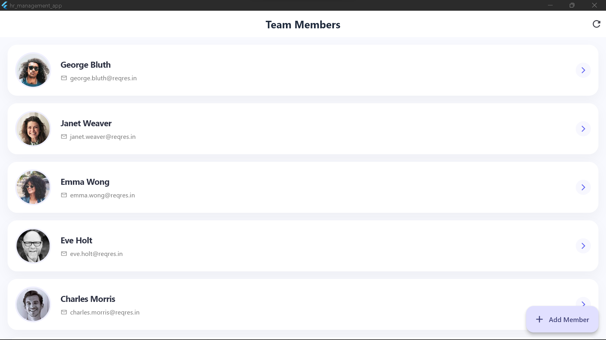
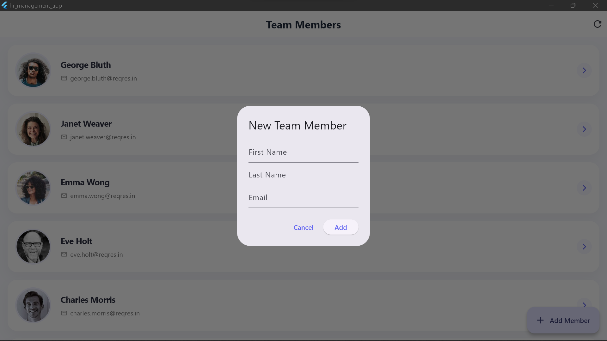
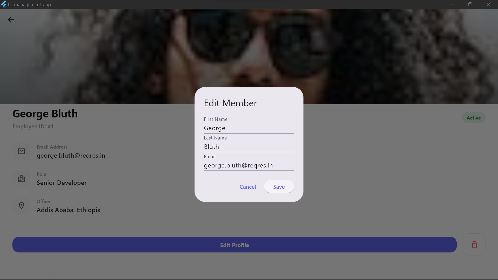

# HR Management App

A Flutter application for managing team members, built as a CRUD demonstration using the ReqRes public API.

## Features

- **Full CRUD Operations**:
  - **Create**: Add new team members with names and emails.
  - **Read**: View a list of all team members and their individual profiles.
  - **Update**: Edit existing team member information.
  - **Delete**: Remove members via swipe-to-delete or from the detail view.
- **State Management**: Built using the latest **Provider** package for a clean and reactive architecture.
- **Network Layer**: Uses the **http** package for RESTful API communication.
- **Premium UI/UX**:
  - Custom Material 3 design system.
  - Smooth Hero animations for profile transitions.
  - Loading indicators and proper error handling with "Try Again" functionality.
  - Dismissible list items for quick deletion.

## Project Structure

The project follows a clean architecture pattern:

```text
lib/
├── core/
│   ├── models/       # Data models (Employee)
│   ├── providers/    # State management (EmployeeProvider)
│   ├── routing/      # Navigation (GoRouter)
│   ├── services/     # API logic (ApiService)
│   └── widgets/      # Shared components (EmployeeCard)
└── features/
    └── presentation/ # UI Screens (HomeScreen, DetailsScreen)
```

## Requirements

- Flutter SDK ^3.11.5
- Provider ^6.1.5+1
- Http ^1.6.0
- GoRouter ^17.2.3

## Screenshots

*(Note: Add your screenshots to the `assets/screenshots` folder and update the links below)*

| Home Screen | Detail View | Add Member | Edit Member |
| :---: | :---: | :---: | :---: |
|  |  |  | 

## Implementation Details

- **API**: [ReqRes.in](https://reqres.in/)
- **Error Handling**: Implemented at both the service and provider layers to catch network failures and display user-friendly messages.
- **Loading States**: Global loading state managed by Provider to show progress indicators during any async operation.
